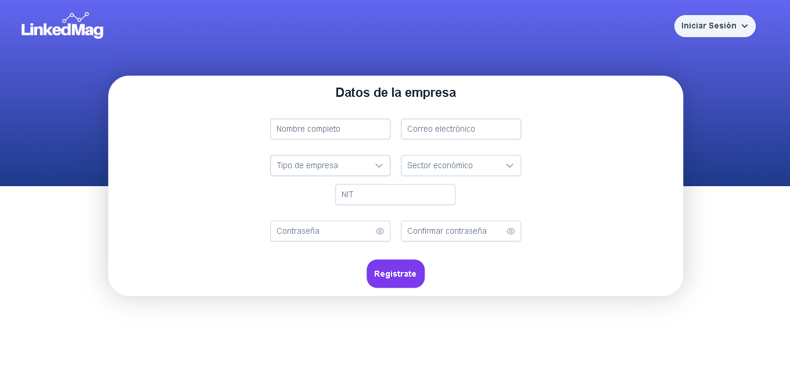
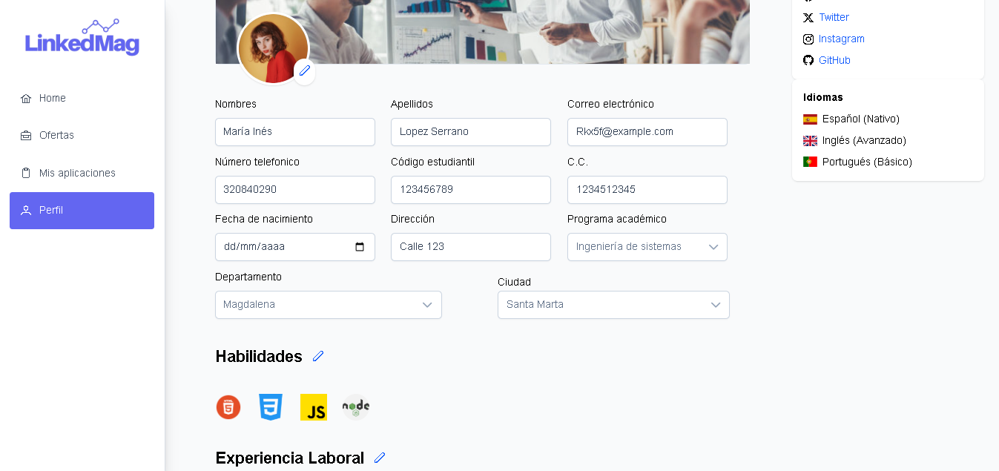

<h1 align="center">🚀 LinkedMag</h1>

<p align="center">
  Plataforma web para conectar estudiantes universitarios con oportunidades laborales de forma eficiente y moderna.
</p>

<p align="center">
  <strong>Desarrollado con Angular + PrimeNG + TailwindCSS</strong>
</p>

---

## ¿Qué es LinkedMag?

**LinkedMag** es una plataforma desarrollada en Angular para la gestión de **ofertas laborales** y **perfiles estudiantiles**, diseñada para facilitar la conexión entre empresas y estudiantes universitarios.  

Ofrece una interfaz intuitiva, moderna y adaptada a las necesidades actuales del entorno académico y empresarial.

---

## Demostración visual

A continuación se muestran capturas de pantalla del funcionamiento de la plataforma:

<p align="center">
  
</p>
<p align="center">
  
</p>
<p align="center">
  
</p>

---

## Tecnologías utilizadas

- ⚙️ [**Angular CLI 19.2.6**](https://angular.io/)
- 🎨 [**PrimeNG**](https://www.primefaces.org/primeng/)
- 🧩 [**PrimeIcons**](https://www.primefaces.org/primeicons/)
- 📐 [**PrimeFlex**](https://www.primefaces.org/primeflex/)
- 🌈 [**TailwindCSS PrimeUI**](https://www.npmjs.com/package/tailwindcss-primeui)

---

## Instalación y configuración

1. Clona el repositorio:
   ```bash
   git clone <url-del-repositorio>
   cd linked-mag-front
   ```
2. Instala las dependencias:
   ```bash
   npm install
   ```
3. Inicia el servidor de desarrollo:
   ```bash
   ng serve
   ```
4. Abre tu navegador en [http://localhost:4200/](http://localhost:4200/)

---

## Contribuidores del proyecto
Este proyecto fue desarrollado por:

>- [Carlos Lizarazo](https://github.com/CALR0)
>- [Daniel Ortíz](https://github.com/DanielOrtiz08)
>- [Carlos Romero](https://github.com/Carlos-RomeroRo)
>- [Javier Santodomingo](https://github.com/JavierS2)

---

LinkedMag Team © 2025
